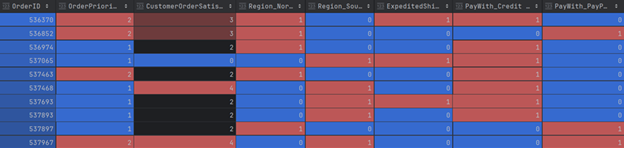
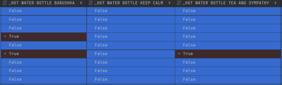
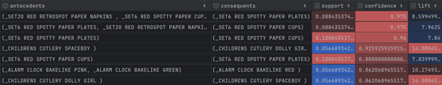
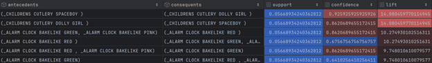
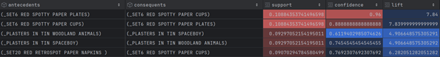
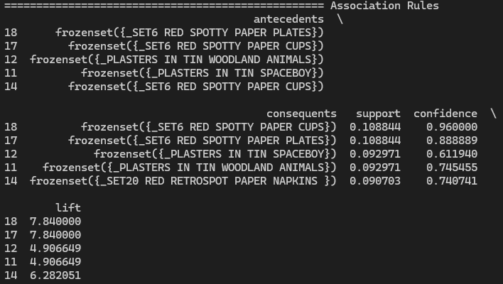

# Market Basket Analysis — Retail Transactional Dataset

This project applies **Market Basket Analysis (MBA)** to a retail transactional dataset to uncover product co-purchase patterns and generate actionable business insights. Using the Apriori algorithm, the analysis identifies which products are frequently bought together and quantifies the strength of those associations — enabling smarter bundling strategies, targeted promotions, and recommendation systems.

The analysis is organized into three parts:

- **Part I — Categorical Encoding:** Five categorical variables (ordinal and nominal) are encoded appropriately — ordinal encoding for satisfaction and priority levels, one-hot encoding for region, payment method, and shipping type.
- **Part II — Transactionalization:** The dataset is reshaped into a binary transaction matrix (441 transactions × 1,562 products) suitable for the Apriori algorithm.
- **Part III — Association Rule Mining:** The Apriori algorithm is run with a confidence threshold of 0.6, generating 34 strong rules evaluated by support, confidence, and lift.

> **Note on Dataset Availability**
> The raw CSV file has been removed from this repository as the data is proprietary and cannot be shared publicly. All descriptive visualizations and encoded output files generated during the analysis have been retained in the `output/` folder for reference and presentation purposes.

---

## Analysis Summary

### Part I — Categorical Encoding

Five variables are selected and encoded for use in downstream analysis:

| Variable | Type | Encoding Method |
|---|---|---|
| `CustomerOrderSatisfaction` | Ordinal | Ordinal (0–4) |
| `OrderPriority` | Ordinal | Ordinal (1–2) |
| `Region` | Nominal | One-Hot |
| `PaymentMethod` | Nominal | One-Hot |
| `ExpeditedShipping` | Nominal (Binary) | One-Hot (single column) |

The encoded dataset is saved as `EncodedCategoricalVars.csv`.

| Encoded Dataset Preview |
|---|
|  |

---

### Part II — Transactional Matrix

The dataset is transformed into a binary matrix where each row is a unique order and each column is a product — cell value is `1` if the product appeared in that order, `0` otherwise.

- **Transactions:** 441 unique orders
- **Products:** 1,562 unique items
- **Output:** `TransactionalDataset.csv`

| Transactional Matrix Preview |
|---|
|  |

---

### Part III — Association Rules (Confidence ≥ 0.6)

The Apriori algorithm produced **34 strong rules**. The three most notable are highlighted below.

#### Rule 1 — Strongest Confidence
**Antecedents:** `SET20 RED RETROSPOT PAPER NAPKINS` + `SET6 RED SPOTTY PAPER CUPS`
**Consequent:** `SET6 RED SPOTTY PAPER PLATES`

| Metric | Value |
|---|---|
| Confidence | 0.975 |
| Lift | 8.59 |
| Support | 0.088 |

| Rule Visualization |
|---|
|  |

---

#### Rule 2 — Strongest Lift
**Antecedent:** `CHILDRENS CUTLERY SPACEBOY`
**Consequent:** `CHILDRENS CUTLERY DOLLY GIRL`

| Metric | Value |
|---|---|
| Confidence | 0.925 |
| Lift | 14.08 |
| Support | 0.057 |

| Rule Visualization |
|---|
|  |

---

#### Rule 3 — Strongest Support
**Antecedent:** `SET6 RED SPOTTY PAPER PLATES`
**Consequent:** `SET6 RED SPOTTY PAPER CUPS`

| Metric | Value |
|---|---|
| Confidence | 0.960 |
| Lift | 7.84 |
| Support | 0.108 |

| Rule Visualization |
|---|
|  |

---
#### All Generated Rules

| Full Rules Table |
|---|
|  |

---


## How to Run

### Prerequisites

```bash
pip install -r requirements.txt
```

### Dataset Setup

Place the dataset CSV inside the `data/` folder:

```
project/
├── data/
│   └── your_dataset.csv        ← put it here
├── main.py
├── requirements.txt
└── README.md
```

### Run

```bash
python main.py
```

The script handles all encoding, transactionalization, Apriori mining, and visualization steps automatically. Results and plots are saved to the `output/` folder.

---

## Project Structure

```
project/
├── data/                        # Raw input dataset (not included — see note above)
├── output/                      # Generated plots, encoded CSV, transactional matrix, rules
│   ├── EncodedCategoricalVars.csv
│   ├── TransactionalDataset.csv
│   └── ...
├── main.py                      # Entry point — run this
├── requirements.txt
└── README.md
```
